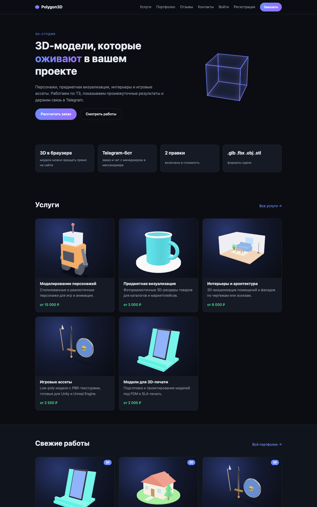
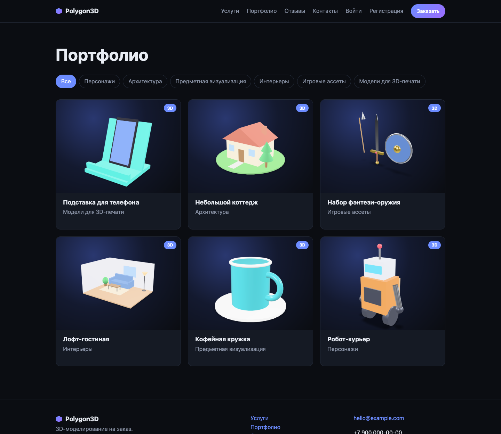
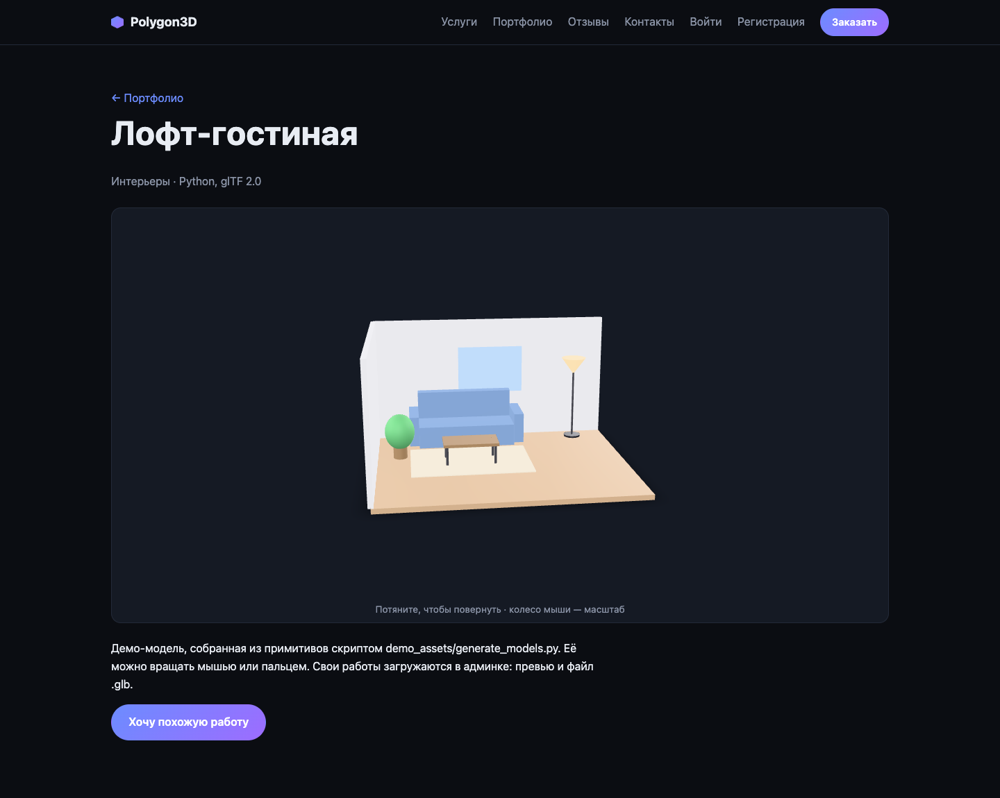
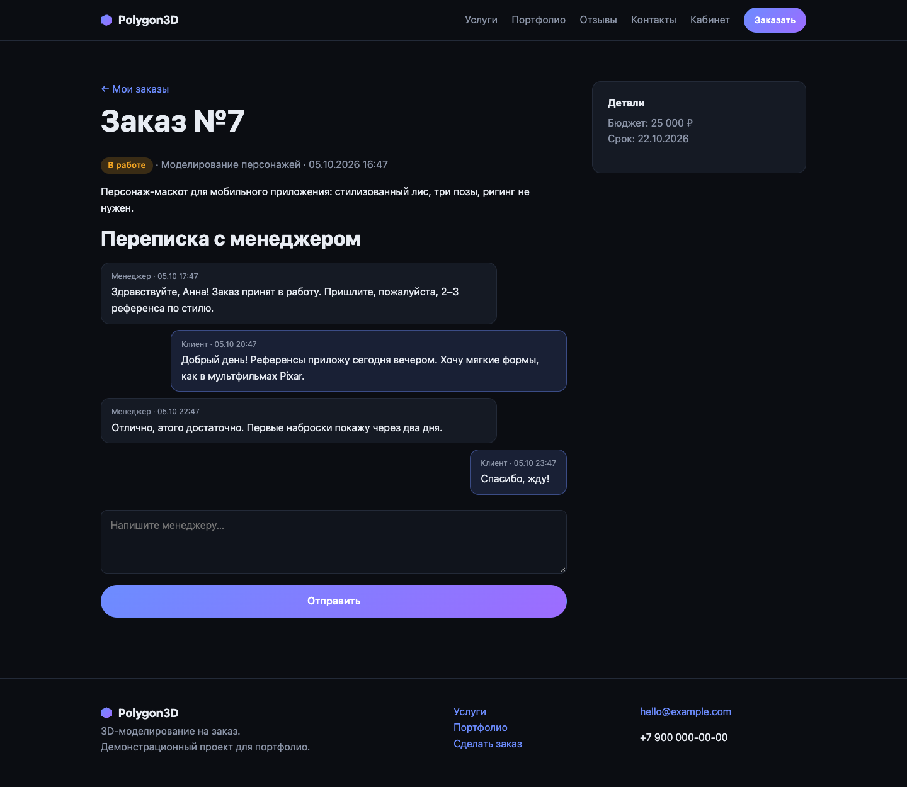
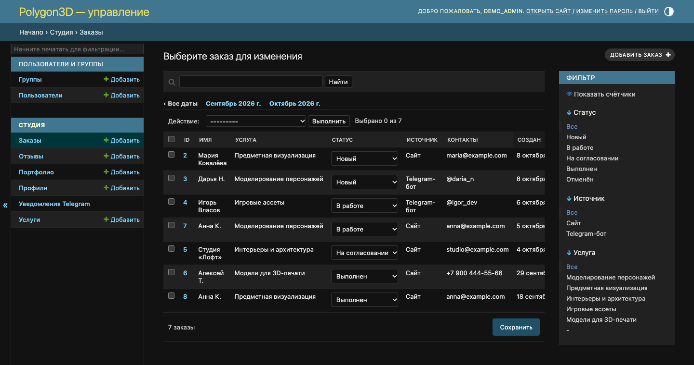
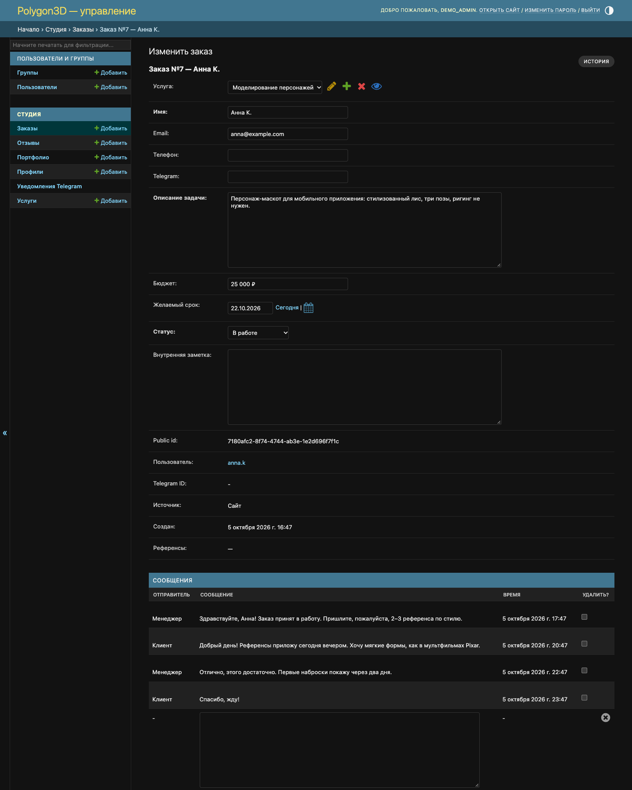
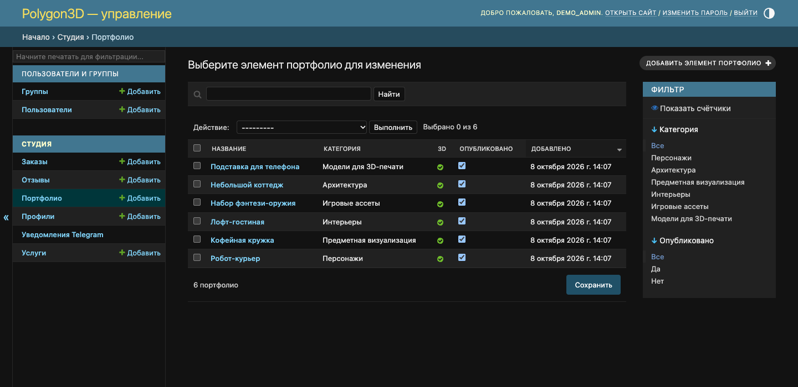
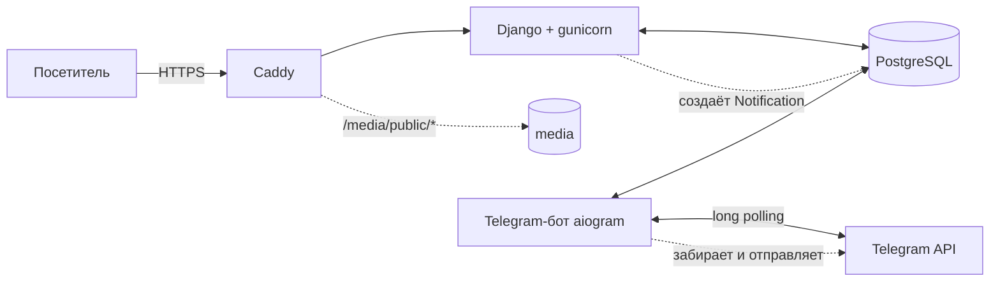

# Polygon3D — сайт студии 3D-моделирования + Telegram-бот

[](https://github.com/Andremuzhik/polygon3d/actions/workflows/ci-cd.yml)


Полноценный проект «под ключ»: сайт студии на Django, Telegram-бот на aiogram, Docker и CI/CD с автоматической сборкой образа и деплоем. Модели в портфолио можно вращать прямо в браузере.



| Портфолио | 3D-просмотр работы |
|---|---|
|  |  |

**Личный кабинет клиента:** статус заказа и переписка с менеджером. Ответы менеджера приходят клиенту и в Telegram.



**Админка менеджера:** заказы со статусами, фильтрами по источнику и услуге, карточка заказа с перепиской, портфолио с отметкой 3D.

| Заказы | Карточка заказа |
|---|---|
|  |  |



## Возможности

**Сайт**
- Главная, каталог услуг с ценами, портфолио с фильтром по категориям и пагинацией
- Интерактивный 3D-просмотр работ (`.glb` / `.gltf`) через `<model-viewer>`
- Форма заказа с референсами: honeypot против ботов, проверка типа и размера файла
- Регистрация, личный кабинет: заказы, статусы, переписка с менеджером, привязка Telegram
- Админка: заказы со статусами и ответами клиенту, услуги, портфолио, отзывы

**Telegram-бот**
- Услуги, портфолио, контакты
- Оформление заказа в диалоге: услуга → описание → телефон → референсы
- «Мои заказы» и чат с менеджером
- Менеджеру: уведомления о заказах и сообщениях, кнопки «Ответить» и смены статуса, `/orders`
- Клиенту: уведомления о смене статуса и ответах менеджера

## Архитектура



Сайт и бот не вызывают друг друга по HTTP, общая только БД. Сайт кладёт сообщения в таблицу `Notification` (паттерн outbox), бот забирает их каждые две секунды. Если бот выключен, уведомления не теряются, а уходят после его запуска.

### Решения, на которые стоит обратить внимание
- **Outbox вместо прямых вызовов Telegram API.** Заказ на сайте не зависит от доступности Telegram, повторы и блокировки бота обрабатываются в одном месте.
- **Приватные файлы клиентов.** Референсы лежат в `media/orders/`, Caddy раздаёт только `media/public/`. Скачать файл заказа можно через Django и только владельцу или сотруднику.
- **Привязка аккаунтов по одноразовой ссылке.** Кабинет и бот связываются через deep link `t.me/<bot>?start=link_<token>`, заказ с сайта привязывается ссылкой `order_<uuid>`.
- **Экранирование.** Весь пользовательский текст в уведомлениях проходит через `html.escape` (тест `test_user_text_is_html_escaped_in_notifications`).
- **Конфигурация только через окружение**, приложение не стартует в проде с дефолтным `SECRET_KEY`.
- **Тесты:** 30 штук, включая бот (aiogram-слой с БД) и outbox; в CI идут на PostgreSQL.

## Быстрый старт (нужен только Docker)

```bash
git clone https://github.com/Andremuzhik/polygon3d.git && cd polygon3d
cp .env.example .env
make up           # сайт: http://localhost:8000
make seed         # демо-услуги, 6 работ с 3D-моделями и отзывы
make superuser    # администратор → http://localhost:8000/admin/
```

Остальное: `make logs`, `make down`, `make test`, `make lint`, `make format`.

### Подключение бота
1. Создайте бота у [@BotFather](https://t.me/BotFather) и получите токен.
2. В `.env` заполните `TELEGRAM_BOT_TOKEN`, `TELEGRAM_BOT_USERNAME` (без `@`) и `TELEGRAM_ADMIN_IDS` (ваш числовой ID, узнать у [@userinfobot](https://t.me/userinfobot); несколько ID через запятую).
3. `docker compose up -d --build`: сервис `bot` стартует сам.

Без токена сайт работает полностью, просто уведомления в Telegram не создаются.

### Демо-модели
Модели и превью из `demo_assets/` созданы для примера: `generate_models.py` собирает сцены из примитивов и пишет настоящие `.glb` без внешних зависимостей, а `preview.html` используется для рендера превью в headless Chrome. Свои работы добавляются в админке: превью и файл `.glb`.

## Структура

```
config/       настройки Django (всё через переменные окружения)
studio/       модели, представления, админка, уведомления, тесты
bot/          aiogram: handlers, keyboards, db-слой, outbox
templates/    шаблоны       static/    CSS и JS
demo_assets/  генератор демо-моделей, .glb и превью
deploy/       docker-compose.prod.yml и Caddyfile для сервера
docs/         скриншоты для README
.github/      CI/CD пайплайн
```

## CI/CD

Пайплайн `.github/workflows/ci-cd.yml`:

| Этап | Когда | Что делает |
|------|-------|-----------|
| `test` | каждый push и PR | ruff, проверка миграций, `check --deploy`, тесты на PostgreSQL |
| `build` | push в `main` | сборка образа, публикация в GHCR (`:sha` и `:latest`) |
| `deploy` | вручную (Run workflow) | копирует compose-файлы на сервер по SSH, делает `pull` и `up -d` |

Деплой запускается вручную, пока не настроены сервер и секреты. Чтобы выкатывать на каждый push в `main`, поменяйте условие `if:` у job `deploy` (подсказка в комментарии рядом).

### Подготовка сервера (один раз)

Нужны VPS с Docker + Compose plugin и домен, направленный A-записью на сервер. Порты 80 и 443 должны быть открыты.

```bash
mkdir -p /opt/polygon3d && cd /opt/polygon3d
nano .env        # см. шаблон ниже
```

`.env` на сервере (в репозиторий не попадает):

```env
DJANGO_SECRET_KEY=<длинная случайная строка>
DJANGO_DEBUG=0
DJANGO_HTTPS=1
DJANGO_ALLOWED_HOSTS=example.com
DJANGO_CSRF_TRUSTED_ORIGINS=https://example.com
SITE_URL=https://example.com
DOMAIN=example.com
POSTGRES_DB=studio
POSTGRES_USER=studio
POSTGRES_PASSWORD=<надёжный пароль>
POSTGRES_HOST=db
TELEGRAM_BOT_TOKEN=...
TELEGRAM_BOT_USERNAME=...
TELEGRAM_ADMIN_IDS=...
```

Сгенерировать ключ: `python3 -c "import secrets; print(secrets.token_urlsafe(50))"`.

### Секреты GitHub (Settings → Secrets and variables → Actions)

| Секрет | Значение |
|--------|----------|
| `DEPLOY_HOST` | IP или домен сервера |
| `DEPLOY_USER` | пользователь SSH (в группе `docker`) |
| `DEPLOY_SSH_KEY` | приватный ключ (публичный — в `~/.ssh/authorized_keys` на сервере) |
| `DEPLOY_PATH` | `/opt/polygon3d` |
| `DEPLOY_PORT` | необязательно, по умолчанию 22 |

Также создайте Environment `production` (Settings → Environments), при желании с ручным подтверждением деплоя. После первого деплоя создайте администратора и, при желании, загрузите демо-данные:

```bash
docker compose -f docker-compose.prod.yml exec web python manage.py createsuperuser
docker compose -f docker-compose.prod.yml exec web python manage.py seed_demo
```

### Что внутри production
- `caddy`: HTTPS (сертификат Let's Encrypt выпускается автоматически), раздаёт только `/media/public/*`
- `web`: gunicorn, миграции при старте, статика через WhiteNoise
- `bot`: тот же образ, команда `python manage.py runbot`
- `db`: PostgreSQL с томом `pgdata`

## Что можно улучшить дальше
- Ограничение частоты заявок (django-ratelimit), капча
- Бэкапы PostgreSQL по расписанию
- Webhook вместо long polling для бота, Sentry для ошибок
- Онлайн-оплата (ЮKassa / Stripe) и счета по заказам

## Лицензия
[MIT](LICENSE)
