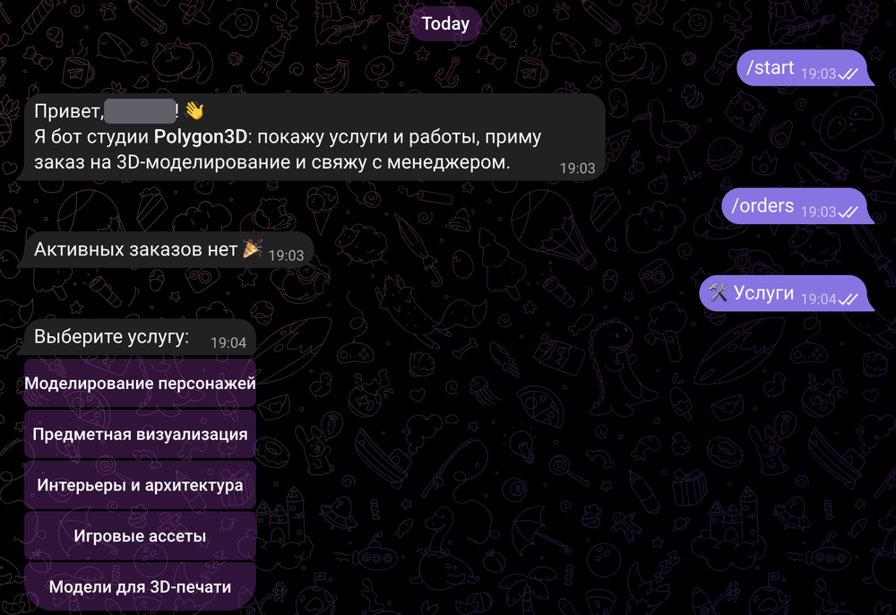
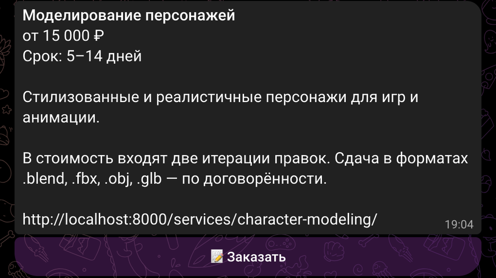
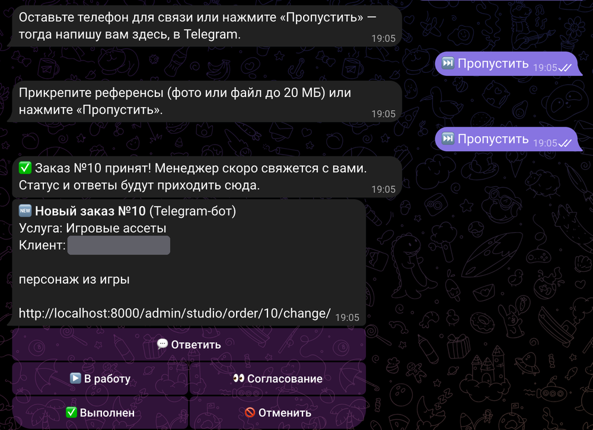
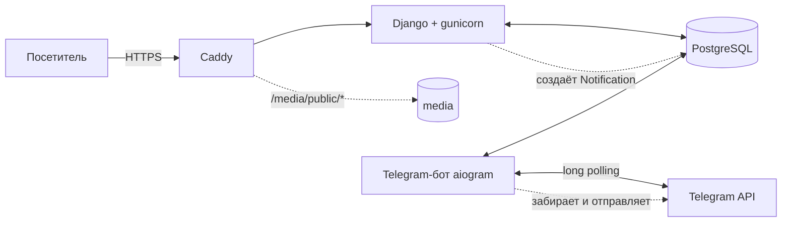

# Polygon3D — сайт студии 3D-моделирования + Telegram-бот

[](https://github.com/Andremuzhik/polygon3d/actions/workflows/ci-cd.yml)
[](https://github.com/Andremuzhik/polygon3d/actions/workflows/security.yml)


Полноценный проект «под ключ»: сайт студии на Django, Telegram-бот на aiogram, Docker и CI/CD с автоматической сборкой образа и деплоем. Модели в портфолио можно вращать прямо в браузере.


| Портфолио | 3D-просмотр работы |
|---|---|
|  |  |

**Личный кабинет клиента:** статус заказа и переписка с менеджером. Ответы менеджера приходят клиенту и в Telegram.


**Админка менеджера:** заказы со статусами, фильтрами по источнику и услуге, карточка заказа с перепиской, портфолио с отметкой 3D.

| Заказы | Карточка заказа |
|---|---|
|  |  |


**Telegram-бот** [@polygon3d_studio_bot](https://t.me/polygon3d_studio_bot): меню, каталог услуг, оформление заказа в диалоге и мгновенное уведомление менеджеру.

| Старт и каталог услуг | Карточка услуги |
|---|---|
|  |  |

Оформление заказа до конца (телефон, референсы, подтверждение) и уведомление менеджеру с кнопками «Ответить» и смены статуса:



## Возможности

**Сайт**
- Главная, каталог услуг с ценами, портфолио с фильтром по категориям и пагинацией
- Интерактивный 3D-просмотр работ (`.glb` / `.gltf`) через `<model-viewer>`, который подгружается по нажатию кнопки
- Форма заказа с референсами: honeypot против ботов, ограничение частоты запросов, проверка файлов по расширению, размеру и содержимому
- Регистрация, восстановление пароля по email, личный кабинет: заказы, статусы, переписка с менеджером, привязка Telegram
- SEO-основа: `sitemap.xml`, `robots.txt`, Open Graph и canonical, фавиконка, свои страницы 404 и 500
- Сдача результата: менеджер прикрепляет файлы к заказу в админке, клиент получает уведомление, скачивает их в кабинете или в боте и **принимает работу либо просит правки** (счётчик правок относительно включённых в стоимость)
- История заказа (кто, что и когда) в кабинете клиента и в админке; письма клиенту: заявка принята, смена статуса, ответ менеджера, результат готов
- Админка: заказы со статусами и ответами клиенту, услуги, портфолио, отзывы; **дашборд** на главной (заказы по месяцам и статусам, средний срок выполнения, заказы без реакции больше суток) и выгрузка заказов в CSV с защитой от формульной инъекции

**Telegram-бот**
- Услуги, портфолио, контакты
- Оформление заказа в диалоге: услуга → описание → телефон → референсы
- «Мои заказы» и чат с менеджером
- Менеджеру: уведомления о заказах и сообщениях, кнопки «Ответить» и смены статуса, `/orders`
- Клиенту: уведомления о смене статуса и ответах менеджера, файлы результата прямо в чате, кнопки «Принять работу» и «Правки»

## Архитектура



Сайт и бот не вызывают друг друга по HTTP, общая только БД. Сайт кладёт сообщения в таблицу `Notification` (паттерн outbox), бот забирает их каждые две секунды. Если бот выключен, уведомления не теряются, а уходят после его запуска.

### Решения, на которые стоит обратить внимание
- **Outbox вместо прямых вызовов Telegram API.** Заказ на сайте не зависит от доступности Telegram, повторы и блокировки бота обрабатываются в одном месте.
- **Приватные файлы клиентов.** Референсы лежат в `media/orders/`, Caddy раздаёт только `media/public/`. Скачать файл заказа можно через Django и только владельцу или сотруднику.
- **Привязка аккаунтов по одноразовой ссылке.** Кабинет и бот связываются через deep link `t.me/<bot>?start=link_<token>`, заказ с сайта привязывается ссылкой `order_<uuid>`.
- **Экранирование.** Весь пользовательский текст в уведомлениях проходит через `html.escape` (тест `test_user_text_is_html_escaped_in_notifications`).
- **Конфигурация только через окружение**, приложение не стартует в проде с дефолтным `SECRET_KEY`.
- **Ограничение частоты.** Заявки, регистрация, вход, сброс пароля и сообщения в кабинете ограничены по IP (`studio/throttle.py`), в боте — не больше 5 заказов в час с аккаунта. Счётчики лежат в кэше в БД, общем для воркеров gunicorn. `X-Forwarded-For` учитывается только за нашим прокси (`DJANGO_BEHIND_PROXY=1` в production compose), иначе лимит можно было бы обойти поддельным заголовком.
- **Проверка загрузок по содержимому.** Расширению файла не доверяем: сигнатуры PNG/JPEG/PDF/ZIP/GLB и других сверяются с началом файла, исполняемые файлы и HTML под видом `.obj`/`.stl` отклоняются. Картинки дополнительно пережимаются в JPEG (до 1600 px), это же убирает всё, что дописано в конец файла.
- **Заголовки безопасности.** CSP без `unsafe-eval` для скриптов (только `wasm-unsafe-eval` и gstatic для декодеров `model-viewer`), `Permissions-Policy`, HSTS за HTTPS. `model-viewer` лежит в `static/vendor` (сценарий `scripts/vendor_model_viewer.sh` проверяет контрольную сумму пакета), сторонних CDN в рантайме нет.
- **Сканирование безопасности.** Отдельный workflow: CodeQL (Python и JS), `pip-audit` по закреплённым зависимостям, Trivy по собранному Docker-образу (падает на исправимых HIGH/CRITICAL), gitleaks по всей истории git; плюс запуск раз в неделю, потому что новые уязвимости появляются и без наших коммитов. Локально то же самое делает `make scan`. Первый же прогон Trivy нашёл уязвимые библиотеки, вшитые в `pip` внутри образа, поэтому `pip` удаляется из итогового образа.
- **Воспроизводимые сборки.** `requirements.in` задаёт ограничения, `pip-compile` собирает `requirements.txt` с хешами (`make lock`), pip ставит их в режиме `--require-hashes`. Обновление зависимостей вручную: `make lock`, уязвимости проверяет еженедельный workflow Security.
- **E2E на боевой конфигурации.** Браузерные тесты идут не против dev-сервера, а против production-образа за Caddy: так проверяются реальные заголовки (CSP, кэш, скрытый `Server`), раздача публичных медиа и закрытость приватных, хешированная статика и 3D-просмотрщик под CSP. Сквозной сценарий проводит заказ через клиента и менеджера (в настоящей админке Django) до приёмки работы.
- **Доступность и скорость.** Lighthouse (мобильный профиль): доступность 100 на проверенных страницах, контраст по WCAG AA, ссылка «Перейти к содержимому», проверено на 390 px без горизонтального переполнения.
- **Тесты:** 146 unit- и интеграционных плюс 11 E2E-сценариев в браузере (см. ниже). Диалоги бота (оформление заказа, чат, права менеджера) гоняются через настоящий aiogram `Dispatcher` с поддельной сессией Telegram, плюс БД-слой, outbox, лимиты и проверка файлов; в CI идут на PostgreSQL. Отдельный smoke-тест поднимает собранный Docker-образ с PostgreSQL и обходит страницы (`make smoke`).

## Быстрый старт (нужен только Docker)

```bash
git clone https://github.com/Andremuzhik/polygon3d.git && cd polygon3d
cp .env.example .env
make up           # сайт: http://localhost:8000
make seed         # демо-услуги, 6 работ с 3D-моделями и отзывы
make superuser    # администратор → http://localhost:8000/admin/
```

Остальное: `make logs`, `make down`, `make test`, `make smoke` (smoke-тест боевого образа), `make e2e` (сценарии в браузере), `make scan` (проверки безопасности), `make lint`, `make format`, `make lock` (пересобрать `requirements.txt` с хешами).

### Подключение бота
1. Создайте бота у [@BotFather](https://t.me/BotFather) и получите токен.
2. В `.env` заполните `TELEGRAM_BOT_TOKEN`, `TELEGRAM_BOT_USERNAME` (без `@`) и `TELEGRAM_ADMIN_IDS` (ваш числовой ID, узнать у [@userinfobot](https://t.me/userinfobot); несколько ID через запятую).
3. `docker compose up -d --build`: сервис `bot` стартует сам.

Без токена сайт работает полностью, просто уведомления в Telegram не создаются.

### Демо-модели
Модели и превью из `demo_assets/` созданы для примера: `generate_models.py` собирает сцены из примитивов и пишет настоящие `.glb` без внешних зависимостей, а `preview.html` используется для рендера превью в headless Chrome. Свои работы добавляются в админке: превью и файл `.glb`.

## Структура

```
config/       настройки Django (всё через переменные окружения)
studio/       модели, представления, админка, уведомления, тесты
bot/          aiogram: handlers, keyboards, db-слой, outbox
templates/    шаблоны       static/    CSS и JS
demo_assets/  генератор демо-моделей, .glb и превью
scripts/      smoke-тест Docker-образа, установка model-viewer
e2e/          сценарии Playwright и стек для них (compose поверх боевого)
deploy/       docker-compose.prod.yml и Caddyfile для сервера
docs/         скриншоты для README
CHANGELOG.md  история изменений
.github/      CI/CD пайплайн
```

## CI/CD

Пайплайн `.github/workflows/ci-cd.yml`:

| Этап | Когда | Что делает |
|------|-------|-----------|
| `test` | каждый push и PR | ruff, проверка миграций, `check --deploy`, тесты на PostgreSQL |
| `e2e` | каждый push и PR | боевой стек с Caddy (HTTPS от внутреннего CA) и сценарии в Chromium через Playwright: страницы и заголовки, 3D по кнопке, мобильная ширина, полный путь «клиент → менеджер в админке → результат → правки → приёмка» |
| `smoke` | каждый push и PR | собирает production-образ, поднимает с PostgreSQL, обходит страницы, проверяет лимит запросов, статику и запуск не от root |
| `build` | push в `main`, после `test`, `smoke` и `e2e` | сборка образа, публикация в GHCR (`:sha` и `:latest`) |
| `Security` (отдельный workflow) | push, PR и раз в неделю | CodeQL, pip-audit, Trivy по образу, gitleaks по истории |
| `deploy` | вручную (Run workflow) | копирует compose-файлы на сервер по SSH, делает `pull` и `up -d` |

Деплой запускается вручную, пока не настроены сервер и секреты. Чтобы выкатывать на каждый push в `main`, поменяйте условие `if:` у job `deploy` (подсказка в комментарии рядом).

### Подготовка сервера (один раз)

Нужны VPS с Docker + Compose plugin и домен, направленный A-записью на сервер. Порты 80 и 443 должны быть открыты.

```bash
mkdir -p /opt/polygon3d && cd /opt/polygon3d
nano .env        # см. шаблон ниже
```

`.env` на сервере (в репозиторий не попадает):

```env
DJANGO_SECRET_KEY=<длинная случайная строка>
DJANGO_DEBUG=0
DJANGO_HTTPS=1
DJANGO_ALLOWED_HOSTS=example.com
DJANGO_CSRF_TRUSTED_ORIGINS=https://example.com
SITE_URL=https://example.com
DOMAIN=example.com
POSTGRES_DB=studio
POSTGRES_USER=studio
POSTGRES_PASSWORD=<надёжный пароль>
POSTGRES_HOST=db
TELEGRAM_BOT_TOKEN=...
TELEGRAM_BOT_USERNAME=...
TELEGRAM_ADMIN_IDS=...
# Почта для сброса пароля (любой SMTP; без EMAIL_HOST письма попадают только в лог)
EMAIL_HOST=smtp.example.com
EMAIL_PORT=587
EMAIL_HOST_USER=...
EMAIL_HOST_PASSWORD=...
DEFAULT_FROM_EMAIL=Polygon3D <noreply@example.com>
```

Сгенерировать ключ: `python3 -c "import secrets; print(secrets.token_urlsafe(50))"`.

### Секреты GitHub (Settings → Secrets and variables → Actions)

| Секрет | Значение |
|--------|----------|
| `DEPLOY_HOST` | IP или домен сервера |
| `DEPLOY_USER` | пользователь SSH (в группе `docker`) |
| `DEPLOY_SSH_KEY` | приватный ключ (публичный — в `~/.ssh/authorized_keys` на сервере) |
| `DEPLOY_PATH` | `/opt/polygon3d` |
| `DEPLOY_PORT` | необязательно, по умолчанию 22 |

Также создайте Environment `production` (Settings → Environments), при желании с ручным подтверждением деплоя. После первого деплоя создайте администратора и, при желании, загрузите демо-данные:

```bash
docker compose -f docker-compose.prod.yml exec web python manage.py createsuperuser
docker compose -f docker-compose.prod.yml exec web python manage.py seed_demo
```

### Что внутри production
- `caddy`: HTTPS (сертификат Let's Encrypt выпускается автоматически), раздаёт только `/media/public/*`
- `web`: gunicorn, миграции при старте, статика через WhiteNoise
- `bot`: тот же образ, команда `python manage.py runbot`
- `db`: PostgreSQL с томом `pgdata`

## Лицензия
[MIT](LICENSE)
